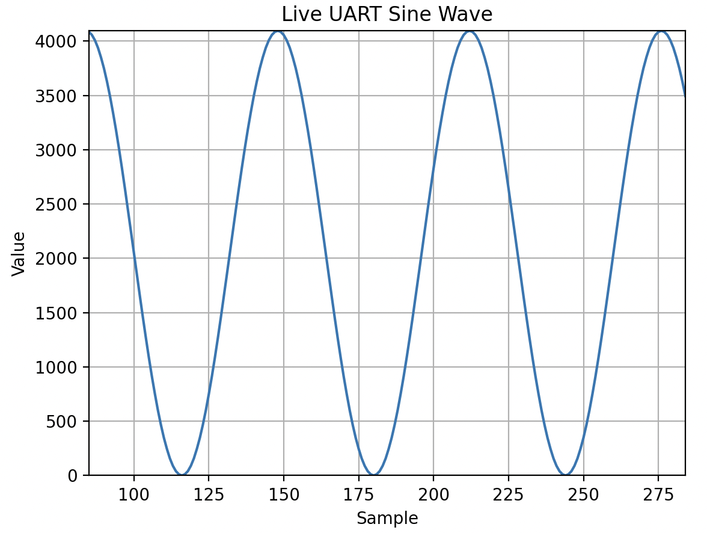
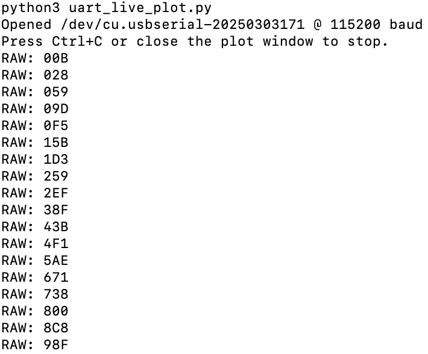

# FPGA UART Sine Wave Monitor

A compact FPGA/RTL project that generates a 12-bit sine wave, streams samples over UART, and visualizes them live in Python.

This project demonstrates RTL design, waveform generation, UART communication, and real-time signal monitoring.

---

## Features

- 12-bit sine wave generator (LUT-based)
- Adjustable sample rate via clock divider
- UART streaming at 115200 baud
- Real-time peak and threshold monitoring
- Python live waveform visualization
- Built and tested on Tang Nano 20K FPGA

---

## Architecture

`waveform_gen → monitor_core → uart_tx → Python plot`

- waveform_gen: Generates 12-bit sine samples  
- monitor_core: Tracks peak and threshold events  
- uart_tx: Sends data over UART  
- Python script: Reads and plots waveform in real time  

---

## Repository Structure

    .
    ├── rtl/
    │   ├── top.v
    │   ├── waveform_gen.v
    │   ├── monitor_core.v
    │   └── uart_tx.v
    ├── constraints/
    │   ├── tang20k.cst
    │   └── tang20k.sdc
    ├── python/
    │   └── uart_live_plot.py
    ├── docs/
    │   ├── demo.png
    │   └── terminal_output.png
    └── README.md

---

## Hardware

- FPGA: Tang Nano 20K  
- Clock: 27 MHz onboard oscillator  
- UART via onboard USB bridge  

---

## Software

- Verilog (RTL design)  
- Gowin IDE (synthesis & implementation)  
- Python 3  

Required Python libraries:

    pip install pyserial matplotlib

---

## How It Works

1. FPGA generates a 12-bit sine wave using a lookup table  
2. Samples are produced at a controlled rate (~100 Hz)  
3. Each sample is converted to hexadecimal ASCII  
4. UART transmits data in the format:

    ABC
    9F2
    800

5. Python reads the serial stream and plots it live  

---

## Setup & Run

### 1. Program FPGA

- Open project in Gowin IDE  
- Ensure top module is set to `top`  
- Build and program the FPGA  

---

### 2. Run Python monitor

    cd python
    python3 uart_live_plot.py

---

### 3. Stop monitoring

- Close the plot window, or press `Ctrl+C`  
- Serial port will be released automatically  
- The FPGA board can be unplugged safely  

---

## Demo

### Live waveform plot

### Terminal UART output

---

## Key Learnings

- RTL-based waveform generation using LUT  
- UART protocol implementation in Verilog  
- Clock-based sampling rate control  
- Hardware-software integration (FPGA + Python)  
- Real-time signal visualization  

---

## Future Improvements

- Add multi-waveform support (triangle, noise)  
- Button-controlled mode switching  
- Higher resolution waveform (e.g. 256-point LUT)  
- CSV logging for offline analysis  
- FFT analysis on Python side  

